<a name="_luxkk8ldd7k6"></a><b><sub>How do I link my custom library with my Qt project (cmake project)</sub></b>

**First way :**
 
1) create a cmake project in Qt creator.

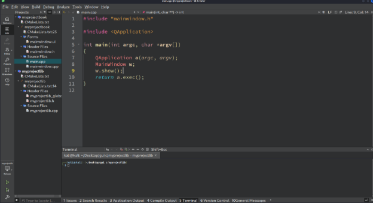

1) Create a cmake custom lib in Qt creator.


1) Make a function and declare into .h file in custom lib.

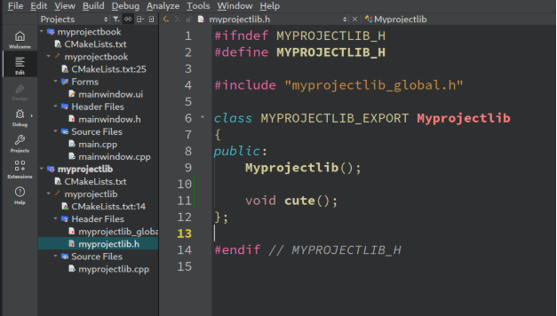

1) Build the lib and check Release folder there is “.so” file. Copy that “.so” file and make a lib folder in your main project and paste it.


1) Add “ link\_directories(${CMAKE\_SOURCE\_DIR}/lib) “ into main project cmake file.
1) And add lib header file/folder path ”include\_directories("/home/kali/Desktop/gui c/myqtlib/")
1) Add target\_link\_libraries(projectname PRIVATE myqtlib)

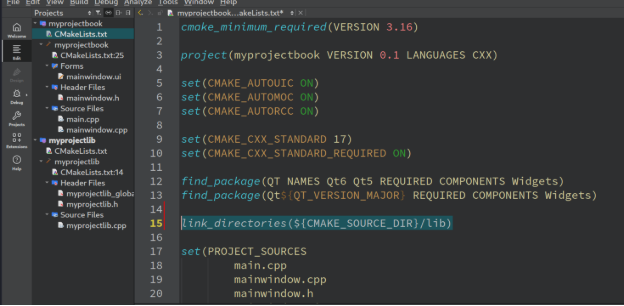

1) Import your custom lib .h file in main.cpp in your main project and run it.

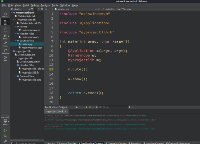

**Second way :** 

1) Create project using cmake in Qt creator.

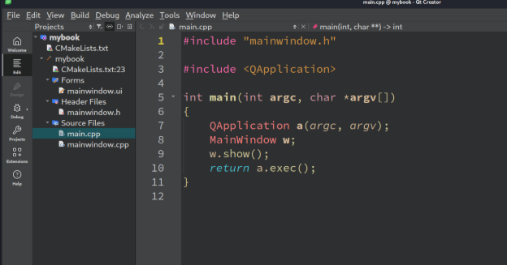

1) Add new c++ header/source file.(two files).

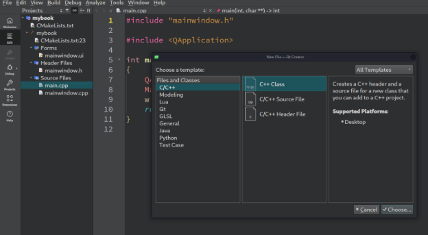

1) Put your custom lib name. It like lib main.cpp.

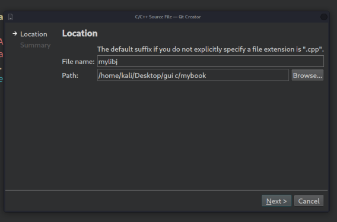

1) Put the header file (.h) name.

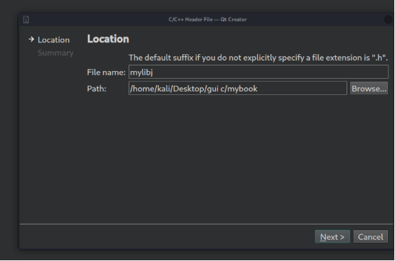

1) Declare function in .h file of your custom header.

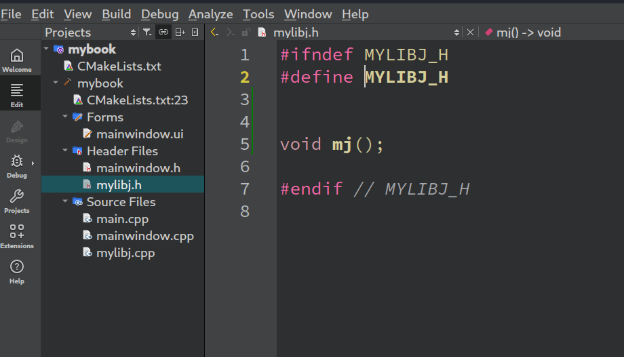

1) Make the function in your lib .cpp file (source file).

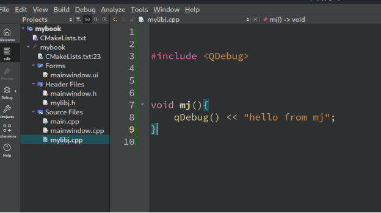

1) Import into main project main.cpp file. And build it.

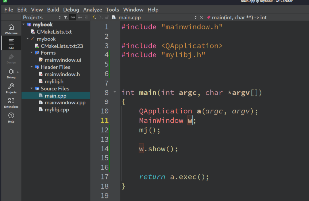


<a name="_m7p8tjj8agx3"></a><a name="_f1m6rgedq45u"></a><a name="_u3zbc866dq8g"></a><a name="_wmgmhws4ry9i"></a><a name="_v5r7w380kmxv"></a><a name="_1iferdb06jw"></a>To install lib with vcpkg and integrate with Qt creator


\### 1. \*\*Ensure `vcpkg` is Set Up Correctly\*\*

Make sure `vcpkg` is installed and the `fmt` library is installed using:

\```bash

vcpkg install fmt

\```

\### 2. \*\*Configure CMake in Qt Creator to Use `vcpkg`\*\*

You need to tell CMake where to find the `vcpkg` toolchain file. This file is typically located in the root of your `vcpkg` installation directory and is named `vcpkg.cmake`.

\- Open your Qt Creator project.

\- Go to the \*\*Projects\*\* mode (left sidebar).

\- Under \*\*Build & Run\*\*, select your kit (e.g., Desktop Qt).

\- Scroll down to the \*\*CMake Configuration\*\* section.

\- Add the following line to the \*\*Initial Configuration\*\* or \*\*CMake Arguments\*\*:

`  ````cmake

`  `**-DCMAKE\_TOOLCHAIN\_FILE=<path-to-vcpkg>/scripts/buildsystems/vcpkg.cmake**

`  ````

`  `Replace `<path-to-vcpkg>` with the full path to your `vcpkg` installation directory.

\---

\### 3. \*\*Update Your `CMakeLists.txt`\*\*

In your `CMakeLists.txt` file, add the following to find and link the `fmt` library:

\```cmake

cmake\_minimum\_required(VERSION 3.14)

project(MyProject)

\# Find the fmt library

find\_package(fmt REQUIRED)

\# Add your executable or library

add\_executable(MyApp main.cpp)

\# Link the fmt library to your target

target\_link\_libraries(MyApp PRIVATE fmt::fmt)

\```

\### 4. \*\*Include `fmt` in Your Code\*\*

In your source files (e.g., `main.cpp`), include the `fmt` header and use it:

\```cpp

#include <fmt/core.h>

int main() {

`    `fmt::print("Hello, {}!\n", "world");

`    `return 0;

}

\```

\---

\### 5. \*\*Build and Run\*\*

\- Save all changes.

\- Build your project in Qt Creator.

\- Run the application to verify that `fmt` is working correctly.

\---

\### Troubleshooting

\- If CMake cannot find `fmt`, double-check that the `vcpkg` toolchain file path is correct.

\- Ensure that the `vcpkg` triplet (e.g., `x64-windows`, `x86-windows`) matches your Qt Creator kit.

\- If you encounter linker errors, ensure that `fmt` is installed for the correct architecture (e.g., 32-bit vs 64-bit).


